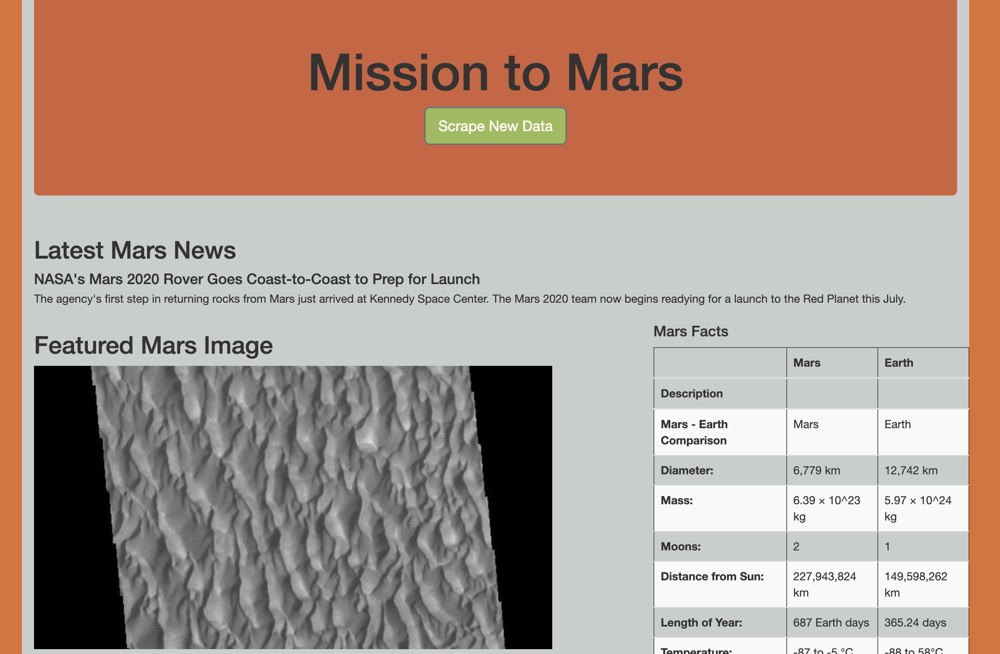
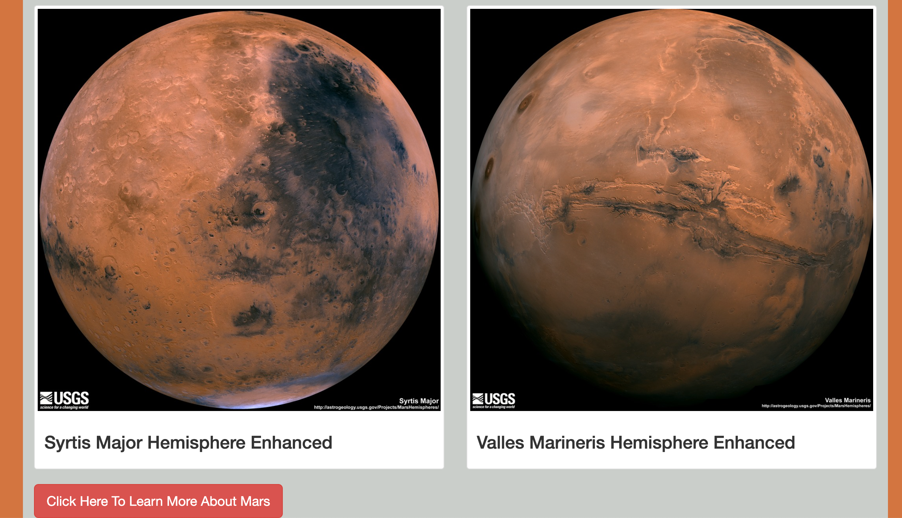

# Mission-to-Mars

## Overview

Created website that scrapes the most recent NASA article on Mars and displays the title and headline on my frontpage. In addition, a recent picture of the surface of Mars is scraped, along with a table containing important facts about Mars. Lastly, images of the 4 hemispheres are displayed, and below these images is a second button that takes the user to a NASA webapge that further discusses facts about Mars. 

## Screenshots

